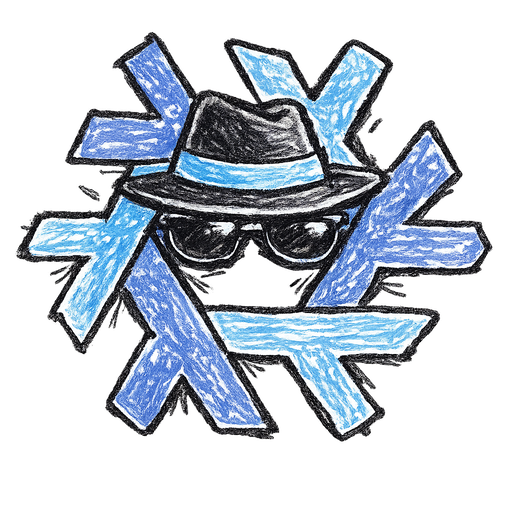

<p align="center">
  
</p>

<h1 align="center">arsenal.nix</h1>

<p align="center">
  Current, reproducible offensive security tools packaged for Nix and NixOS.
</p>

<p align="center">
  <a href="https://github.com/Vortex-Dimension-Digital/arsenal.nix/actions/workflows/ci.yml"></a>
  <a href="https://wiki.nixos.org/wiki/Flakes"></a>
  <a href="LICENSE"></a>
</p>

Packages are built from pinned, hash-verified upstream sources and can be used
directly, through a namespaced package set, or as replacements for Nixpkgs
packages.

> [!WARNING]
> Use these tools only on systems you own or are explicitly authorized to test.

## Highlights

- Packages and runnable apps are discovered automatically.
- Sources and dependencies are pinned for reproducible builds.
- OpenVAS C and Rust outputs share one upstream source and update atomically.
- OpenVAS uses this repository's `gvm-libs` and `nmap` packages.
- Automated workflows check packages and propose dependency updates.

## Packages

<!-- BEGIN GENERATED PACKAGE DOCS -->

| Package | Description | Version |
| --- | --- | --- |
| [`feed-filter`](packages/feed-filter/package.nix) | Utility for filtering OpenVAS feed data | 23.50.14 |
| [`greenbone-certdata-sync`](packages/greenbone-certdata-sync/package.nix) | Compatibility command for synchronizing Greenbone CERT data | 25.4.1 |
| [`greenbone-feed-sync`](packages/greenbone-feed-sync/package.nix) | Tool for downloading the Greenbone Community Feed | 25.4.1 |
| [`greenbone-nvt-sync`](packages/greenbone-nvt-sync/package.nix) | Compatibility command for synchronizing Greenbone vulnerability tests | 25.4.1 |
| [`greenbone-scapdata-sync`](packages/greenbone-scapdata-sync/package.nix) | Compatibility command for synchronizing Greenbone SCAP data | 25.4.1 |
| [`gvm-libs`](packages/gvm-libs/package.nix) | Libraries module for the Greenbone Vulnerability Management Solution | 23.9.2 |
| [`nmap`](packages/nmap/package.nix) | Free and open source utility for network discovery and security auditing | 7.991 |
| [`openvas`](packages/openvas/package.nix) | Scanner component for Greenbone Community Edition | 23.50.14 |
| [`openvasd`](packages/openvasd/package.nix) | Rust scanner service for OpenVAS | 23.50.14 |
| [`scannerctl`](packages/scannerctl/package.nix) | CLI frontend for OpenVAS scanner utilities | 23.50.14 |
| [`scannerlib`](packages/scannerlib/package.nix) | OpenVAS Rust workspace | 23.50.14 |

<!-- END GENERATED PACKAGE DOCS -->

## Quick start

Run a package without installing it:

```console
nix run github:Vortex-Dimension-Digital/arsenal.nix#nmap -- --version
```

## Use in NixOS

Add the flake as an input and install a package directly:

```nix
{
  inputs.arsenal.url = "github:Vortex-Dimension-Digital/arsenal.nix";

  outputs =
    {
      nixpkgs,
      arsenal,
      ...
    }:
    {
      nixosConfigurations.my-host = nixpkgs.lib.nixosSystem {
        system = "x86_64-linux";
        modules = [
          {
            environment.systemPackages = [
              arsenal.packages.x86_64-linux.nmap
            ];
          }
        ];
      };
    };
}
```

### Namespaced overlay

The default overlay avoids collisions with Nixpkgs by exposing packages under
`pkgs.arsenal`:

```nix
{
  nixpkgs.overlays = [ inputs.arsenal.overlays.default ];
  environment.systemPackages = [ pkgs.arsenal.nmap ];
}
```

`overlays.namespaced` is an explicit alias for `overlays.default`.

### Direct overlay

To expose packages directly and replace same-named Nixpkgs packages:

```nix
{
  nixpkgs.overlays = [ inputs.arsenal.overlays.direct ];
  environment.systemPackages = [
    pkgs.nmap
    pkgs.openvas
  ];
}
```

## Development

Package definitions live in `packages/<name>/package.nix` and are discovered
automatically.

```console
nix develop
nix fmt
nix flake check
./scripts/generate-package-docs.py --check
```

The package table in this README is generated from evaluated flake metadata and
must not be edited manually:

```console
./scripts/generate-package-docs.py
```

See [CONTRIBUTING.md](CONTRIBUTING.md) for package conventions and validation
requirements.

## Updates

Update one package:

```console
nix run .#update -- nmap
```

List the automatically discovered packages with:

```console
nix run .#update -- --list
```

The scheduled workflows check every independent package source and open a pull
request for each available update. OpenVAS C and Rust outputs update together;
flake inputs are updated separately each week. Automated pull requests are
verified but are never merged automatically.

## License

The repository's Nix packaging code is MIT licensed. Individual tools retain
their upstream licenses.
